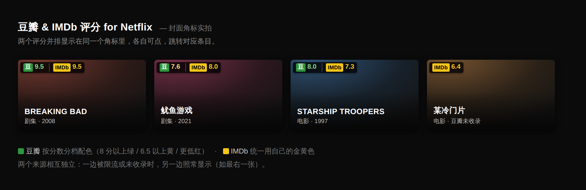

<h1 align="center">Douban &amp; IMDb Ratings</h1>

<p align="center">
  A Chrome extension that shows <b>both Douban and IMDb ratings</b> right on <b>Netflix</b> and <b>Prime Video</b> artwork, each linking to its own entry.
</p>

<p align="center">
  
  
  
  
  
</p>

<p align="center">
  <a href="README.md">简体中文</a> · <b>English</b>
</p>



> The screenshot is captioned in Chinese because that is the extension's UI language. The badge itself shows only a
> logo and a number, so it reads the same regardless of your Netflix locale.

---

## Highlights

|  | |
| --- | --- |
| **Two sites** | Netflix and Prime Video, sharing one main loop and both rating sources |
| **Two ratings, side by side** | Douban first (green), IMDb second (IMDb's own amber) — you can tell at a glance which is which |
| **The two sources are independent** | If Douban is rate-limited, IMDb still shows; and vice versa. Either can be switched off on its own |
| **Each segment links to its own site** | Click green for the Douban entry, amber for the IMDb entry. Neither triggers Netflix playback |
| **Interface language doesn't matter** | English originals, Simplified translations and Traditional Taiwanese titles all resolve. IMDb is the tricky one — it *finds* Chinese titles but only ever answers with English ones, so it gets its own cross-script matcher |
| **Titles you click get priority** | A click is the strongest interest signal on the page: that title jumps the queue, and one earlier "not found" gets retried |
| **Rather show nothing than a wrong score** | Below the confidence threshold the badge stays empty instead of showing a plausible-looking mismatch |

## Install

Development build for now — build it yourself:

```bash
npm install
npm run build
```

Then in Chrome open `chrome://extensions` → turn on **Developer mode** (top right) → click **Load unpacked** → pick the `dist` directory.

> **After changing code, three steps**: `npm run build` → click 🔄 on the extension card in `chrome://extensions` → reload the Netflix tab. Skipping any one of them looks exactly like a code bug. See "Check which build is actually running" below.

## Settings

Click the extension icon in the toolbar:

| Setting | What it does |
| --- | --- |
| Enable extension | Master switch. Turning it off clears every badge on the page immediately |
| Enable on Netflix | Off injects nothing on Netflix |
| Enable on Prime Video | Same, for Prime Video |
| Show Douban rating | Off means no requests are sent to Douban at all |
| Show IMDb rating | Off means no requests are sent to IMDb at all |
| Show on list artwork | Off restricts badges to the detail modal |
| Show in detail modal | The preview modal that opens on hover |
| Placeholder when not found | Off by default — keeps list pages cleaner |
| Badge position | Any of the four corners |
| Clear rating cache | Forces a re-query. Clears both sources together |

The popup footer shows cached entry counts per source and how many titles are on the interest list; when a source is rate-limited it turns amber and shows when it recovers.

## What to expect

**On a page you haven't browsed before, a fair number of cards will have no rating.** That's not a bug, it's a deliberate trade-off: the extension talks to both sites anonymously (no cookies — see Privacy), and Douban's anonymous quota is tight. Requests are therefore rate-limited hard, and only issued for cards you actually stop and look at. **Hits are cached for 7 days, so the content you watch regularly fills in over time.**

**The two sources arrive at different speeds.** Douban is spaced 2.5s apart, IMDb much less (0.6s), so IMDb usually lands first and Douban catches up. Seeing only the amber segment for a moment is normal.

**Ratings appear progressively, not all at once.** Cards in the viewport are queued top-to-bottom, left-to-right.

**Want one first? Click it.** Opening a card tells the extension you're interested: that lookup jumps to the front of the queue, and if it previously showed "not found" it gets re-queried — that result was most likely just a rate limit at the time. A given title is only re-queried once per 30 minutes, so clicking repeatedly costs nothing extra. The record is local only (200 titles max).

## Troubleshooting

| Symptom | What to do |
| --- | --- |
| No badges at all | **First tell the two cases apart**: run `document.documentElement.dataset.dbrLoaded` in the console. A value means the script was injected — look for the "no title cards found" warning next (that's a selector failure). **`undefined` means the script never ran at all** — see "The script wasn't injected" below |
| Only a few titles have ratings | Normal — see "What to expect". Let the cache build up |
| Odd text inside the badge | Usually another extension (a translator) mutating the DOM. See "Coexisting with other extensions" |
| A rating is clearly on the wrong title | That's a real bug. Extension icon → "Search endpoint diagnostics" → use "Single title trace", and send the output |
| Amber rate-limit notice in the popup | Wait for the time it shows; the extension stops issuing requests until then |

**The script wasn't injected (`dbrLoaded` is `undefined`).** This is a different failure from "the selectors stopped matching", and the page gives you nothing to tell them apart — if the script never ran, not even the console warning appears. Check in this order:

1. **Try the other site.** Run the same expression on Netflix. A value there but not here means the manifest's match patterns don't cover the current domain; nothing on either means the extension isn't loaded or wasn't rebuilt.
2. **Look at the URL.** Prime Video ships in two shapes: the standalone `primevideo.com`, and `/gp/video/` paths on regional amazon domains. Both are in the manifest, but the amazon domains are enumerated one by one (`.com` / `.co.jp` / `.de` …) and your region may not be on the list. Send the URL, or just add a line to `content_scripts` in `manifest.json`.
3. **Mind the bare domain.** A pattern like `https://www.primevideo.com/*` does **not** match `primevideo.com` without the `www` — it has to be `https://*.primevideo.com/*`. That trap has been hit once already; `tests/manifest.test.ts` now guards it.

**Check which build is actually running.** `npm run build` prints a build stamp, and the content script writes the same stamp onto `<html data-dbr-loaded>`. Run `document.documentElement.dataset.dbrLoaded` in the console on a Netflix page — only if they match is your new code actually live.

For verbose logs: run `localStorage.setItem('dbr:debug', '1')` in the console and reload.

## Privacy

The extension does exactly two things over the network: send a title to Douban and IMDb to search, and fetch the rating back. Nothing is reported to any third party; the rating cache lives only in `chrome.storage.local` in your browser.

**The "titles you clicked" list is local too.** It stores a normalized title and a timestamp, 200 entries max, used purely to order the request queue. It is never sent with a request and never uploaded. Turning off the master switch stops recording.

**Neither source is sent cookies (`credentials: 'omit'`) — a deliberate trade-off.** Sending your Douban cookie (even just the anonymous `bid` you get from visiting the site, no login needed) would share the far more generous quota that normal browsing gets, and most similar extensions do exactly that. This one stays anonymous instead. The cost is a tight quota and a fair number of blank cards on first visit.

Permissions requested: `storage` (settings and cache), plus the five hosts needed to fetch data: `search.douban.com`, `movie.douban.com`, `v3.sg.media-imdb.com`, `v2.sg.media-imdb.com`, `api.graphql.imdb.com`. Nothing beyond that.

## Known limitations

- **Not distributable.** IMDb's GraphQL response carries terms forbidding public/commercial use — see "Terms of use" below. Personal use is fine; publishing would require a different data source.
- The anonymous quota is tight, so a fresh page has many blank cards until the cache fills. That is the direct cost of the no-cookie choice above.
- List cards usually carry no year, so matching uses the stricter threshold (88); the detail modal supplies a year and relaxes it to 70.
- Obscure titles and Netflix-exclusive non-English content may be missing from both sources — list pages stay blank, the modal shows "not found".
- Traditional→Simplified conversion uses a hand-curated table covering characters common in film titles (`src/shared/text.ts`), not full OpenCC. A missing character can only cause a miss, never a wrong match.
- Series are matched per season; a query with no season defaults to season 1. IMDb has one entry per series and does not split by season.
- Prime Video's selectors are converged against the live DOM, but only for one region and one page layout. If a different region or a redesign breaks them, run `scripts/dom-probe.js` and send the report back.
- Prime Video currently covers `primevideo.com` only; the `/gp/video/` paths on regional amazon domains are not wired up yet (one line in the manifest's `content_scripts`).

---

# Technical notes

## How it works

```
Content script (in the Netflix page)     background service worker
┌────────────────────────────┐        ┌────────────────────────────────┐
│ MutationObserver           │        │ RatingLookup ×2                │
│   finds newly rendered cards│       │   cache / dedupe / priority    │
│ IntersectionObserver       │        │   agnostic about data source   │
│   queries only what enters │──msg──→│     ├─ DoubanProvider          │
│   the viewport             │        │     │    queue 2.5s · cache r3:│
│ badge                      │←───────│     └─ ImdbProvider            │
│   several sources in one   │        │          queue 0.6s · cache i1:│
│   badge, each independent  │        │ matcher                        │
└────────────────────────────┘        │   scores candidates; below the │
                                      │   threshold, shows nothing     │
                                      │ InterestStore                  │
                                      │   clicked titles → high prio   │
                                      └────────────────────────────────┘
```

**Each source owns a separate queue and cache.** Not fastidiousness — necessity: the two sites rate-limit independently, and a shared queue would mean Douban's backoff stalls IMDb too, when Douban's anonymous quota is precisely the one most easily exhausted. Kept apart, the worst case is losing half the numbers rather than the whole badge.

<details>
<summary><b>How Douban data is fetched</b> (two-tier search, soft rate-limit detection, why the subject page isn't parsed)</summary>

**Douban has no public API.** API v2 stopped issuing keys long ago, so this uses the two search endpoints Douban's own site uses. Primary/fallback, both verified against the live site:

- **Primary: `movie.douban.com/j/subject_suggest`.** Light (a few hundred bytes), carries year and original title (`sub_title` holds the original-language title), works for Simplified and English. Its rate-limit behaviour is to **return an empty array rather than an error** — which once led us to conclude it was dead and switch away entirely, when it was merely throttled at the time. Traditional Chinese misses, so the layer above converts to Simplified first.
- **Fallback: `search.douban.com/movie/subject_search`.** Parses the `window.__DATA__` blob embedded in the results page. Much wider recall (it searches alternate titles, which is how HK/TW translations resolve) and carries ratings inline — but rate-limits cookie-less access hard, going soft after a handful of requests: **HTTP 200 + `error_info:"搜索访问太频繁。"` + empty items**. That shape was once treated as a valid empty result and cached as "not found", which made an entire page of titles (Breaking Bad included) show as missing. So a non-empty `error_info` must be handled as a rate limit and never as "Douban doesn't have this title". This endpoint is only used when suggest yields no confident match, and self-silences for 5 minutes after a soft limit without affecting suggest.

Suggest carries no rating, so a hit is topped up via `subject_abstract`; full-search results include ratings and skip that step. None of these endpoints has a stability contract, so parsing is permissive on input and strict on output; `__DATA__` is extracted by bracket matching rather than a regex.

**The subject page HTML is not parsed.** `movie.douban.com/subject/<id>/` was going to be the rating fallback; in practice the very first request is redirected to the `sec.douban.com` anti-bot page. That path not only fails to get a rating, it drives the request queue into backoff and penalises subsequent legitimate requests — so it was removed entirely. The search results page is not subject to the same restriction.

**Any interface language works.** Search result titles are often "Chinese name + original" concatenated (`星河战队 Starship Troopers`), so parsing splits them into two names that are matched separately — without the split, an English query only counts as a substring relation and can't clear the no-year threshold.

</details>

<details>
<summary><b>How IMDb data is fetched</b> (measured findings, cross-script matching, terms of use)</summary>

**IMDb likewise has no free third-party API** — the official one is paid, and OMDb requires the user to register a key. So this uses the endpoints imdb.com itself uses, with the same caveat as Douban: no stability contract.

Everything below is measured, not assumed.

### Search: `v3.sg /suggestion/x/` (fallback `v2.sg /suggestion/t/`)

| Endpoint | English | Simplified | Traditional |
| --- | :-: | :-: | :-: |
| `v3.sg /suggestion/x/` | ✅ | ✅ | ✅ |
| `v2.sg /suggestion/t/` | ✅ | ✅ | ✅ |
| `/suggestion/{first-letter}/` variants | ✅ | ❌ 404 | ❌ 404 |
| Legacy JSONP `/suggests/` | ✅ | ❌ 404 | ❌ 404 |

**Chinese queries work directly** — no need to translate the title to English first. Fields returned: `i, id, l, q, qid, rank, s, tl, y, yr`. `tl` is a display subtitle (`"2008-2013 TV Series"`), not a localized title, so parsing ignores it. Responses mix in people (`nm` prefix) and franchises (`in` prefix); only `tt` entries are kept.

### Ratings: `api.graphql.imdb.com`, and three custom headers are mandatory

```
x-imdb-client-name: imdb-web-next
x-imdb-user-country: US
x-imdb-user-language: en-US
```

Same URL, same query, three ways of asking — the results are unambiguous:

| Request | Result |
| --- | --- |
| Bare POST | ❌ 403 (nginx 403 page) |
| GET instead | ❌ 403 |
| POST + the three headers | ✅ 200 · 444 bytes · `{"aggregateRating":9.5,"voteCount":2668078}` |

What matters is that all three are **custom headers**, which an extension is allowed to set. `Origin` and `Referer` are forbidden header names in the Fetch spec — an extension setting them is silently ignored by the browser. Fortunately the measurements show they aren't needed.

**The title-page fallback has been removed.** In a real browser `www.imdb.com/title/…` also returns just 1997 bytes of anti-bot interstitial (the body literally contains `enable javascript` and `challenge`), and `/find` returns an identical byte count for four completely different queries. Keeping it would mean downloading 2KB of nothing on every failure and reporting a misleading "no rating data on the page" — a sentence that would send the next investigation into the parser, where the cause isn't. Same judgement as removing the Douban subject-page fallback earlier. Accordingly `www.imdb.com` and `m.imdb.com` were dropped from `host_permissions` — badge links are ordinary links and need no permission.

### Matching with a Chinese UI: IMDb finds Chinese titles but only answers in English

This is the measured finding that would otherwise make the feature useless for Chinese users. Querying 鱿鱼游戏 returns:

```json
{"id":"tt10919420","l":"Squid Game","qid":"tvSeries","y":2021}
```

Literal similarity between 鱿鱼游戏 and "Squid Game" is zero, so the generic matcher throws the result away — **the search succeeded and the rating was discarded by our own code**.

So IMDb gets its own matcher (`src/background/imdb/match.ts`). When generic scoring finds nothing it falls back to cross-script matching, using IMDb's own search ranking as the evidence: it knows the Chinese alias, and a hit ranks first. That signal is weaker than a literal match, so the rules are strict:

- **Only the top result counts.** Lower-ranked entries are related works — the "Breaking Bad" query returned 8 rows and the third was *El Camino*; attaching its rating would be wrong.
- **Types must be compatible** — a film can't match a series.
- **If a year is known it must agree** (±1). The detail modal supplies a year, and that's the strongest corroboration available.
- **Not used when the scripts are comparable**: if both sides are Latin and still didn't match, they genuinely didn't match, and "ranked first" shouldn't force one through.

IMDb also has one entry per series rather than one per season (Douban splits by season), so the season suffix is stripped before matching — otherwise the generic matcher's season penalty misfires.

### ⚠️ Terms of use

The GraphQL response carries this notice from IMDb:

> Public, commercial, and/or non-private use of the IMDb data provided by this API is not allowed.

Personal use is fine, **but this is a blocker for publishing to the Chrome Web Store**. Actual distribution would need a properly licensed source — OMDb with a user-supplied key, or IMDb's official public datasets at `datasets.imdbws.com` (reachable, per measurement, but a full TSV dump — a completely different shape). That decision needs to be made before any distribution.

</details>

<details>
<summary><b>Diagnosing the next time an endpoint changes</b> (two complementary tools)</summary>

The findings above came out of these two tools. Both live in the repo and **run on your own machine**:

```bash
node scripts/imdb-probe.mjs              # probe every candidate path in one pass
node scripts/imdb-probe.mjs --self-test  # offline; verifies the script's own judgement logic
node scripts/imdb-probe.mjs --curl       # prints equivalent curl commands, sends nothing
```

Zero dependencies — no `npm install`, no build, Node 18+ runs it directly. Groups tested, in order:

| Group | What it checks |
| --- | --- |
| 0 · Reachability | Six hosts as **three states**: unreachable / reachable-but-refused / fine. The middle one is the one most often misread as "the endpoint is dead" |
| 1 · Search endpoints | 7 candidates × 4 title languages, confirming the `l`/`y`/`qid` fields `parse.ts` depends on |
| 2 · Rating paths | GraphQL, page JSON-LD, `__NEXT_DATA__`, `/ratings/`, mobile — with size and latency |
| 2b · Deep dive | Only when every rating path failed: retries under six identities and flags anti-bot interstitials |
| 3 · Header sensitivity | One endpoint, four header sets, including `Origin: chrome-extension://…` — **what the extension actually sends** |
| 4 · Official dataset | `datasets.imdbws.com`, the one path with real published terms |
| 5 · End to end | With `--title "Some Title"`, walks search → rating |

**Windows notes** (the script handles these):

- Chinese Windows cmd defaults to code page 936, so Node's UTF-8 output looks like mojibake. Run `chcp 65001` first, or use Windows Terminal. **Mojibake only affects the terminal** — the report in `probe-out/` is always valid UTF-8.
- `--curl` generates per platform: on Windows it emits `curl.exe` (in PowerShell, `curl` is an alias for `Invoke-WebRequest`), double quotes, `^` continuations and `findstr` instead of `grep`. POST bodies are always written to a file and referenced with `-d @` rather than inlined — JSON already contains double quotes, and inlining breaks under cmd's MSVCRT argument rules while PowerShell expands `$` as a variable.

Two traps the script warns about:

- **Node's built-in fetch ignores `HTTPS_PROXY` by default** (browsers and curl honour it). So "the browser opens imdb.com but the script is all red" is entirely possible and does not mean the endpoint is down. Behind a proxy, run `NODE_USE_ENV_PROXY=1 node scripts/imdb-probe.mjs`.
- **Run `--self-test` first.** The script was written in an environment where every IMDb host was refused, so its judgement logic had never executed its success branch. A bug there would surface as "everything is red" — a false negative that sends the investigation the wrong way.

The other entry point is **"Search endpoint diagnostics → Run IMDb diagnostics"** in the extension popup, which runs in the browser with requests issued by Chrome itself. **When the two disagree, trust the browser** — that's where the extension actually runs.

The current rating approach was settled exactly this way: all six Node paths failed, suggesting IMDb had locked everything down; in the browser, "GraphQL + custom headers" returned 200 immediately. Node cannot reproduce a real TLS fingerprint or HTTP/2 framing order, so being blocked is Node's problem, not the endpoint's.

</details>

<details>
<summary><b>Quota discipline</b> (viewport filtering, dwell gating, backoff across restarts, click priority)</summary>

**The anonymous quota is tight and every request is precious.** Measured: a set of queries that all resolved minutes earlier will collectively come back empty after repeated requests. The whole design is organised around not wasting requests:

- **Only query cards you actually stop on.** Filter by viewport first (a home page renders hundreds of cards; you see a dozen), then add a 600ms dwell gate — during fast scrolling a great many cards flash past, and queueing on viewport entry alone spends the quota on artwork nobody looked at. Cards that scroll past aren't unobserved, so scrolling back re-triggers them.
- **Backoff state must survive service worker restarts.** MV3 recycles the worker after ~30s idle; if the backoff record lived only in memory it would reset, and every pause-then-scroll would start hammering a site that is still throttling, digging the limit deeper. It's persisted in `chrome.storage.local` as an absolute recovery timestamp, restored by remaining duration, and continues doubling from its current depth.
- **Spend quota on what the user clicked.** A click is the strongest interest signal on the page, yet the extension used to treat "opened deliberately" and "scrolled past" identically — same queue, same "not found" TTL, a clear mismatch under a tight quota. Clicks are now recorded in `chrome.storage.local`: that title's lookup jumps to the front of the queue (FIFO preserved within each tier) and may bypass one "not found" cache entry **written before the click**. The re-query rewrites the cache whatever the outcome, so the bypass expires immediately; with a 30-minute click cooldown on top, no title gets re-queried repeatedly. The interest key uses only normalized title + season, deliberately excluding year and type — list cards can't supply either, and using the full cache key would put "clicked the card" and "modal lookup" under different keys, wasting the signal entirely.
- Concurrent lookups for the same title are deduplicated; hits are cached 7 days, misses 12 hours.
- All outbound requests go through a rate-limited queue; a 403/429 or an anti-bot page triggers exponential backoff — the anti-bot page returns 200, so status code alone would read as success and both body content and final redirect URL have to be inspected.

**Rather show nothing than a wrong score.** Title matching normalizes (full/half width, Traditional/Simplified, diacritics, punctuation, season suffixes) and scores candidates, with year and type as disambiguators. The threshold is 70 with a year and tightens to 88 without — list cards usually have no year, and a mere substring relation isn't enough to call two titles the same film. Attaching *Batman Returns*' score to *Batman* is worse than showing nothing.

</details>

<details>
<summary><b>Adding Prime Video: why the selectors key off routes, not classes</b></summary>

Netflix and Prime Video differ only in DOM knowledge — the observers, dwell gating, badge rendering, click-interest and card-recycling detection are identical, and they are the most heavily trapped part of this project (scores attached to the wrong artwork, duplicate badges across mount points, clicking a badge being recorded as interest — each one actually happened). So all of it moved into `src/content/site.ts`, and a site supplies only a `SiteAdapter`: a set of selectors plus how to read a title out of the DOM. Netflix's entry file went from 362 lines to 26 with no behavioural change (all 333 existing tests stayed green).

**The selectors have now been converged against the live DOM.** The first version was written from inference, and the live site showed what that costs: it treated all 181 route-matching links as title cards — including the Play button (the extension really did look up a film called "Watch now") and aria-hidden duplicate links. It now works in three layers: the site's own card markers (`data-testid="poster-link"`, `data-card-title`) first, with the route contract as a fallback that explicitly excludes the things that merely look like cards:

**Key off the routing contract, not the styling.** Title cards are identified purely by `/detail/<ASIN>` in the `href`. The stability difference is an order of magnitude:

| Basis | Stability |
| --- | --- |
| CSS-in-JS hash classes (`_1x_1`) | Change every build; depending on them is planting a landmine |
| `data-testid` / `data-automation-id` | More stable than classes, but still internal conventions that get renamed |
| **The `/detail/<ASIN>` route** | A product contract with users; changing it means a site-wide redesign |

The same test also decides which `<a>` elements are *not* films: the page is full of category, account and help links, and route filtering keeps them out — which matters more than anything else under Douban's tight quota.

The detail page gets one extra gate: Prime Video's detail is a **full page navigation**, not a modal, so `extractFromDetail` first checks whether the URL is a `/detail/` page and returns null otherwise. Without that gate, every visit to the home page would look up whatever the `h1` says — usually "Prime Video" or a category name.

**How to converge the selectors**: open the console on a Prime Video browse page and paste in the whole of `scripts/dom-probe.js`. It doesn't check whether my guesses were right — it **discovers the structure from scratch**: finds title cards by link URL, then lays out the card itself, four levels of ancestors, the artwork image and every `data-*` hook. Send the report back and the selectors can be rewritten from evidence.

</details>

<details>
<summary><b>When Netflix changes its DOM</b></summary>

Netflix is a commercial site with no public contract. All DOM knowledge lives in `src/content/netflix/selectors.ts`, where every position has an ordered list of candidate selectors — a redesign only requires touching that one file.

**Only `data-uia`, never classes.** Netflix's classes are CSS-in-JS hashes (`default-ltr-iqcdef-cache-19c3xp8`) that change every build; depending on them is planting a landmine. `data-uia` is Netflix's own test hook and far more stable. A title card is `a[data-uia="standard-card"]` with the title in that element's `aria-label`.

**Card types are enumerated, never wildcarded.** The same `*-card` family includes `cloud-game-card`; looking up a game name finds nothing and burns quota doing it.

Test fixtures are real HTML captured from the live site, not written from memory. There's a lesson behind that: the first version's selectors were written from memory, every unit test passed, and not a single card matched in production — **for adapter code, fixture authenticity matters far more than test count**.

The content script self-checks: if no card is found 8 seconds after page load, it logs a warning.

The build stamp came out of the same round: `git pull` doesn't rebuild, and a rebuild still needs a click in the extensions page — skipping either looks exactly like a code bug. **When a change doesn't take effect, first prove the new code is running, then start doubting the logic.**

</details>

<details>
<summary><b>Coexisting with other extensions</b></summary>

The badge declares `translate="no"` and `notranslate`, and CSS hides any foreign element inside it. Not over-engineering: Immersive Translate treats the 豆 glyph as translatable text, renders it as 豆子, and injects the translation wrapped in a `<font>` inside the badge — which renders as "豆 豆子 8.4".

Note the nesting in that CSS rule: the badge's direct children are `.dbr-part`, with the logo and value one level down. Adding a source without updating the rule hides that entire segment, silently — hence a test that watches exactly this nesting.

Problems like this are invisible in local development, where those extensions aren't installed. When a user reports a rendering oddity, asking for the `outerHTML` of `document.querySelectorAll('.dbr-badge')` beats any amount of guessing: that dump made `immersive-translate-target-wrapper` obvious at a glance, after two rounds of fixing the wrong thing ("duplicate badges").

</details>

<details>
<summary><b>Layout and commands</b></summary>

```
src/
├── shared/          shared by all three ends: types, message protocol, settings, text normalization
├── background/      service worker
│   ├── provider.ts  the "rating source" interface: decouples search/match/fetch from the outer logic
│   ├── douban/      Douban client, response parsing, provider
│   ├── imdb/        IMDb client, response parsing, cross-script matching, provider
│   ├── matcher.ts   candidate scoring and thresholds (shared by both sources)
│   ├── queue.ts     rate-limited queue and backoff
│   ├── cache.ts     rating cache (prefixed per source, stored separately)
│   ├── interest.ts  titles the user clicked, used to raise lookup priority
│   └── lookup.ts    cache / dedupe / priority orchestration, agnostic about the source
├── content/
│   ├── badge.ts     badge injection and updates (several sources in one badge)
│   ├── dom.ts       DOM helpers shared by both sites (ordered candidate selectors)
│   ├── site.ts      site-agnostic main loop: observers, dwell gating, badges, click-interest
│   ├── netflix/     Netflix adapter
│   │   ├── selectors.ts   every piece of Netflix DOM knowledge lives here
│   │   ├── extract.ts     card / modal → query
│   │   └── index.ts       declares the adapter; the loop lives in site.ts
│   └── primevideo/  Prime Video adapter (same shape)
└── popup/           settings page
```

| Command | Purpose |
| --- | --- |
| `npm run build` | Bundle into `dist/` and print the build stamp |
| `npm run watch` | Rebuild on source changes |
| `npm test` | Unit tests (425 cases) |
| `npm run typecheck` | TypeScript check |
| `npm run check` | Typecheck + tests + build. Run this before committing |
| `npm run icons` | Regenerate the PNGs under `icons/` |
| `npm run probe:imdb` | Probe IMDb's data paths from this machine |
| `npm run probe:imdb:self` | Offline; verifies only the probe script's own logic |

The screenshot at the top is generated by `scripts/gen-hero.mjs` (needs a one-off `playwright` install). It pulls in `dist/badge.css` directly, so the image can't drift from the real styling.

</details>

<details>
<summary><b>Development notes</b></summary>

The sandboxed CI environment can't reach `douban.com`, and IMDb's hosts are refused by network policy, so data-layer tests all run against fixtures — but the fixtures are **real responses captured from the live endpoints**, not constructed from memory. Endpoint availability can only be verified in a browser.

When an endpoint breaks again, the popup has a "Search endpoint diagnostics" button that opens a page probing each candidate and printing the real response — no DevTools needed. That page (`src/probe/`) is temporary scaffolding and should be removed once the endpoints settle.

It has paid for itself four times: finding that `subject_suggest` moved from `www` to the `movie` subdomain; finding that full search's soft rate limit was being mistaken for an empty result; confirming that suggest returning an empty array is throttling rather than death; and establishing that IMDb's GraphQL requires custom headers.

Three general lessons:

1. **Never assume a third-party endpoint's response shape from memory.**
2. **For an endpoint with no contract, "empty result" can always mean "rate-limited"** — think twice before caching it as fact.
3. **A local script failing doesn't mean the endpoint is unavailable.** Node can't reproduce a real browser's TLS fingerprint, so being caught by anti-bot measures is the norm — conclusions have to be drawn in the real runtime environment.

</details>

---

## Changelog

<details open>
<summary><b>v0.3.0</b> — IMDb support</summary>

Both ratings side by side in one badge: Douban green, IMDb amber, each clickable.

- **Extracted a "rating source" layer.** Cache, dedupe, click priority, the "not found" re-query and its self-limiting, error classification — that outer logic is identical for both sources, and it's the most error-prone, most heavily tested part of this project. Duplicating it for IMDb would have re-planted every mine, so it became the `RatingProvider` interface with the outer logic written once.
- **Two independent queues and caches.** Douban's backoff no longer stalls IMDb; the worst case is losing half the numbers.
- **The badge became multi-segment.** One badge with several segments rather than two badges: card badges are absolutely positioned, and two independent badges overlap the moment mount-point resolution drifts — a trap already hit once in v0.2.
- **Every IMDb data path was verified against the live service.** No endpoint code written from memory. A local probe tool and an in-browser diagnostic page were built for this and corroborate each other.
- **Cross-script matching.** IMDb finds Chinese titles but answers in English; without handling that, the IMDb segment would be almost always empty on a Chinese UI.

</details>

<details>
<summary><b>v0.2.1</b> — Clicks signal interest</summary>

A click is the strongest interest signal on the page, yet the extension had been treating deliberately-opened and scrolled-past titles identically. A click now moves that lookup to the front of the queue and allows it to bypass one "not found" cache entry written before the click.

</details>

<details>
<summary><b>v0.2.0</b> — First genuinely usable version</summary>

v0.1 built the architecture, but all three external dependencies turned out not to match reality. v0.2 corrected each against the live services:

- **Netflix selectors rewritten.** v0.1's were written from memory and matched zero cards in production — Netflix had replaced its entire DOM.
- **Douban's data path corrected three times.** Endpoint retired → domain change → misdiagnosed as dead and abandoned → settled on the two-tier approach.
- **Quota discipline.** Backoff surviving service worker restarts, dwell gating, versioned cache invalidation.
- **Coexistence with translation extensions.** The badge declares `translate="no"`.

</details>
